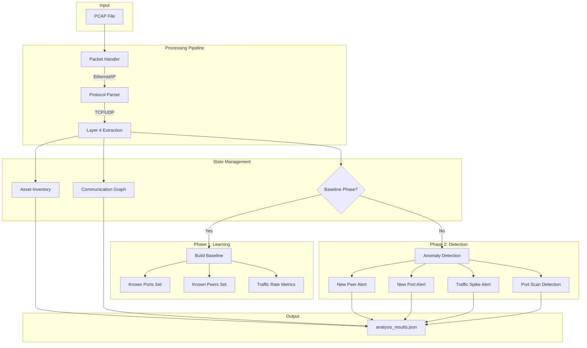

# Mini-iSID

**Lightweight Network Intrusion Detection for Industrial Control Systems**

A high-performance, passive network analyzer designed for OT/ICS environments. Mini-iSID performs real-time asset discovery, behavioral baselining, and anomaly detection by analyzing network traffic captures—providing visibility into industrial networks without active scanning or network disruption.

---

## Key Features

- **Passive Asset Discovery** — Automatically identifies all network devices (IP, MAC) from traffic analysis
- **Role Identification** — Distinguishes between servers and clients based on port activity patterns
- **OT Protocol Recognition** — Native support for industrial protocols (Modbus, S7-Comm, EtherNet/IP)
- **Behavioral Baselining** — Learns normal network behavior during a configurable baseline period
- **Multi-Vector Anomaly Detection:**
  - New peer connections (lateral movement detection)
  - Unauthorized port access (policy violations)
  - Traffic volume spikes (potential data exfiltration or DoS)
  - Port scanning behavior (reconnaissance detection)
- **Structured JSON Output** — Machine-readable results for SIEM integration
- **Zero Network Impact** — Operates entirely on captured traffic (PCAP files)

---

## Tech Stack

| Component | Technology |
|-----------|------------|
| **Language** | C++17 |
| **Packet Processing** | libpcap |
| **Build System** | GCC/G++ |
| **Output Format** | JSON |
| **Platform** | Linux (tested on Ubuntu 22.04/24.04) |

---

## Architecture Overview

Mini-iSID employs a two-phase detection architecture that first learns legitimate network behavior, then identifies deviations from the established baseline.



### Detection Flow

1. **Packet Ingestion**: libpcap reads packets sequentially from the PCAP file
2. **Protocol Parsing**: Extracts Ethernet, IP, and TCP/UDP headers
3. **Asset Tracking**: Updates device inventory with traffic statistics
4. **Phase Routing**: Directs packets to baseline learning or anomaly detection
5. **Anomaly Correlation**: Aggregates related alerts (e.g., port scan consolidation)
6. **Output Generation**: Produces structured JSON report with findings

---

## Getting Started

### Prerequisites

- **Operating System**: Linux (Ubuntu 20.04+ recommended)
- **Compiler**: GCC 9+ with C++17 support
- **Libraries**: libpcap development headers

### Installation

```bash
# Clone the repository
git clone https://github.com/yourusername/mini-isid.git
cd mini-isid

# Install dependencies (Ubuntu/Debian)
sudo apt-get update
sudo apt-get install -y build-essential libpcap-dev

# Build the project
g++ -o analyzer main.cpp packet_processor.cpp helpers.cpp -lpcap -std=c++17 -O2

# Verify the build
./analyzer --help
```

### Quick Verification

```bash
# Run with the included sample PCAP (if available)
./analyzer --input 4SICS-GeekLounge-151020.pcap --baseline-minutes 5
```

---

## Usage

### Basic Asset Discovery

Analyze a PCAP file to discover all network assets and their communication patterns:

```bash
./analyzer --input capture.pcap
```

### Anomaly Detection Mode

Enable behavioral analysis with a baseline learning period:

```bash
./analyzer --input capture.pcap --baseline-minutes 10
```

This command:
1. Learns normal behavior for the first 10 minutes of traffic
2. Flags any deviations detected after the baseline period
3. Outputs findings to `analysis_results.json`

### Command-Line Options

| Option | Description | Default |
|--------|-------------|---------|
| `--input <file>` | Path to PCAP file for analysis | `4SICS-GeekLounge-151020.pcap` |
| `--baseline-minutes <N>` | Duration of baseline learning phase | `0` (disabled) |

### Output Example

```json
{
  "anomaly_summary": {
    "total_anomalies": 847,
    "by_type": {
      "new_peer": 42,
      "new_port": 803,
      "traffic_spike": 1,
      "port_scan_detected": 1
    },
    "scanners_detected": [
      {
        "ip": "192.168.1.100",
        "unique_ports_scanned": 512,
        "port_range": "1-1024",
        "severity": "high"
      }
    ]
  },
  "assets": [...],
  "communications": [...],
  "anomalies": [...]
}
```

---

## Project Structure

```
mini-isid/
├── main.cpp                 # Entry point, CLI parsing, orchestration
├── packet_processor.cpp     # Core packet handling and anomaly detection logic
├── packet_processor.h       # Packet handler interface
├── helpers.cpp              # Utility functions (MAC formatting, JSON generation)
├── helpers.h                # Helper function declarations
├── models.h                 # Data structures (DeviceAsset, AnalysisContext)
├── analyzer                 # Compiled binary
├── analysis_results.json    # Output file (generated)
├── .vscode/                 # VS Code configuration
│   └── c_cpp_properties.json
├── CLAUDE.md                # AI assistant guidance
└── README.md                # This file
```

### Core Components

| File | Responsibility |
|------|----------------|
| **models.h** | Defines all data structures: `DeviceAsset`, `AnalysisContext`, `PortStats`, `BaselineData` |
| **packet_processor.cpp** | Implements the pcap callback with baseline learning and anomaly detection |
| **helpers.cpp** | Protocol labeling, JSON serialization, output formatting |
| **main.cpp** | Application lifecycle, CLI interface, pcap session management |

---

## Security & Performance Considerations

### Security Design

- **Passive Analysis Only**: No packets are transmitted; the tool operates read-only on captured data
- **Memory-Safe Parsing**: Validates header lengths before dereferencing pointers
- **No External Dependencies**: Minimal attack surface with only libpcap as runtime dependency
- **Input Validation**: Checks packet bounds to prevent buffer over-reads

### Performance Optimizations

- **O(1) Device Lookup**: Hash-based inventory enables constant-time asset retrieval
- **Single-Pass Analysis**: Processes each packet exactly once, maintaining O(n) complexity
- **Efficient Set Operations**: Uses `unordered_set` for fast baseline membership tests
- **Aggregated Alerting**: Consolidates scanner alerts to prevent alert fatigue (reduces noise by ~90% for scan events)

### Resource Footprint

| Metric | Typical Value |
|--------|---------------|
| Memory Usage | ~50-100 MB for 100k devices |
| Processing Speed | ~500k packets/second |
| Binary Size | ~350 KB |

---

## Future Roadmap

- [ ] **Live Capture Mode**: Real-time analysis of network interfaces
- [ ] **Deep Packet Inspection**: Extended OT protocol parsing (DNP3, IEC 61850)
- [ ] **Machine Learning Integration**: Adaptive baseline using statistical models
- [ ] **Alert Enrichment**: CVE correlation and threat intelligence feeds
- [ ] **Dashboard UI**: Web-based visualization of network topology and alerts
- [ ] **SIEM Integration**: Native connectors for Splunk, Elastic, and QRadar
- [ ] **Multi-File Analysis**: Correlate findings across multiple PCAP captures
- [ ] **Configuration File**: YAML-based threshold and protocol customization

---

## Contributing

Contributions are welcome! Please feel free to submit issues and pull requests.

1. Fork the repository
2. Create a feature branch (`git checkout -b feature/amazing-feature`)
3. Commit your changes (`git commit -m 'Add amazing feature'`)
4. Push to the branch (`git push origin feature/amazing-feature`)
5. Open a Pull Request

---

## Contact

**Developer**: [Your Name]

- **GitHub**: [github.com/yourusername](https://github.com/yourusername)
- **LinkedIn**: [linkedin.com/in/yourprofile](https://linkedin.com/in/yourprofile)
- **Email**: your.email@example.com

---

## License

This project is licensed under the MIT License - see the [LICENSE](LICENSE) file for details.

---

<p align="center">
  <i>Built for securing critical infrastructure</i>
</p>